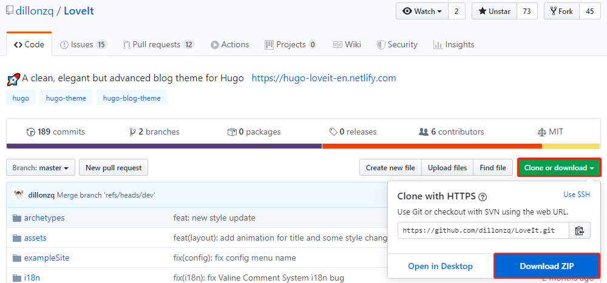
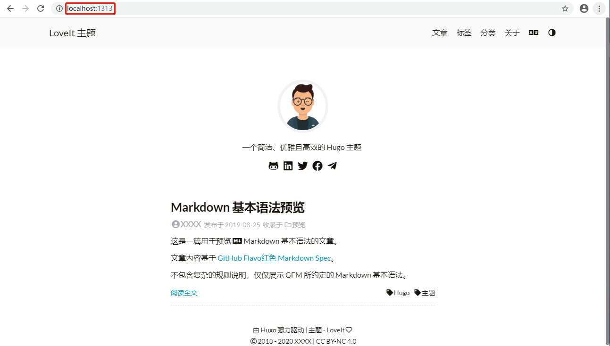

# 基于Hugo快速搭建个人博客


<!--more-->

转载请注明出处：https://hts0000.github.io/

## 1 引言
本文用于记录基于HUGO搭建个人博客的步骤和注意事项，阅读时长大概30分钟。
适用于以下人员：
- 想搭建博客
- 想了解hugo
- 闲着没事

## 2 准备阶段
**在开始搭建博客前，希望你已经准备好以下工具，以便能快速的跟上本篇文章。**
- [Git Bash](https://git-scm.com/downloads)
- [Notepad++](https://notepad-plus-plus.org/downloads/)
- [VSCode](https://code.visualstudio.com/)

**文章将会从如下三个大步骤进行展开。**
- 基于HUGO的本地博客
- 定制本地博客
- 使用GitHub展示博客内容

## 3 基于HUGO的本地博客
**想要在本地搭建一个基于HUGO的博客，大致有如下三步。**
1. 安装hugo
2. 获取一个hugo主题
3. 启动hugo

**第一步，安装hugo。**

前往hugo的github仓库获取对应操作系统的[hugo执行程序](https://github.com/gohugoio/hugo/releases)。


完成之后打开cmd终端，输入hugo version，如能正确显示hugo的版本即为安装成功。


安装成功后在cmd终端执行如下命令，在D盘生成hugo博客站点MyBlog。
```
hugo new site D:\MyBlog
```

**第二步，获取HUGO主题。**

hugo的主题是博客的门面，博客的风格和样式都基于主题。如果有前端编程的能力，也可以自行设计属于自己的主题，或者前往[hugo主题商店](https://themes.gohugo.io/)下载现成的主题。这里以[LoveIt
](https://themes.gohugo.io/loveit/)主题为例。

点击Download前往LoveIt的github仓库进行下载。



将下载好的压缩包解压到`D:\MyBlog\themes`目录下，并将目录重命名为LoveIt。

将`D:\MyBlog\themes\LoveIt\exampleSite\zh`目录下的所有文件和`D:\MyBlog\themes\LoveIt\exampleSite\static`目录复制到`D:\MyBlog\`目录下。
- zh目录：LoveIt主题的中文配置及界面内容
- zh\config.toml：LoveIt主题的集中配置文件
- zh\content目录：LoveIt主题的默认页面内容
- static目录：LoveIt主题的图包

使用Notepad++或其他文本编辑工具打开config.toml文件，将
~~staticDir = ["../static", "../../assets/others"]~~
改成staticDir = ["/static", "../assets/others"]。

**第三步，启动本地博客。**

在cmd终端执行如下命令，启动监听。
```
hugo server -D --config D:\MyBlog\config.toml
```
在浏览器访问URL:`localhost:1313`，可以查看本地博客。


## 4 定制本地博客
**定制一个充满个人元素的博客大概分为如下三步。**
1. 个性化的博客标题和个人介绍
2. 个性化的头像和图标
3. 个性化的博客内容

**第一步，定制个人的博客标题和介绍。**

关于如何修改博客的标题等，`D:\MyBlog\config.toml`文件内作者有非常完善的注释，大家多修改多尝试（先备份），这里不细讲。

**第二步，个性化头像和图标。**

点击[Favicon Generator](https://realfavicongenerator.net/)，打开`Select your Favicon image`上传一张你喜欢的图片。


上传之后成功之后来到页面最下方点击`Generate your Favicons and HTML code`，Favicon Generator会自动分辨率生成符合一系列PC和移动终端的图标。


点击`Favicon package`下载生成好的图标包。


将下载好的图标包解压，把里面的文件全部复制到`D:\MyBlog\static\`目录下。
如果想要替换主页的头像图标，需要替换`D:\MyBlog\static\images\avatar.png`，推荐分辨率为528*560。

最后整体效果如下图所示。


**第三步，个性化的博客内容。**

博客的最终目的是展示内容，hugo能非常方便的根据文章的设定生成标签(tags)和分类(categories)。下面教大家如何设置文章的模板。

**设置博客文章的模板**

LoveIt主题中作者已经写好了一个文章模板，这里直接套用这个模板进行修改即可。

首先将`D:\MyBlog\themes\LoveIt\archetypesdefault.md`文件复制到`D:\MyBlog\archetypes`目录下，使用VsCode等markdown编辑工具打开。


**生成一篇博客文章**

打开cmd终端，执行如下命令，根据文章模板生成第一篇文章。
```
# 进入D盘
D:
# 进入MyBlog目录
cd MyBlog
# 生成博客文章，文章会生成在content/posts目录下
hugo new posts/我的第一篇博客.md
# 启动hugo，开启监听
hugo server -D --config D:\MyBlog\config.toml
```
再次访问URL:`localhost:1313`即可看到刚刚添加的文章。

## 5 用GitHub展示博客文章
让GitHub仓库展示博客页面，大致有如下四步。
- 创建一个GitHub账号
- 创建一个同名仓库
- hugo build生成页面
- 推送到GitHub远程仓库

**第一步，创建一个GitHub账号。**

网上有很多教程，不再赘述。

**第二步，创建一个同名仓库**

网上也有很多教程，只枪强调一点，仓库名称为`username.github.io`。如：你的用户名叫`zhangshan000`，则你的仓库名必须为`zhangsan000.github.io`。


**第三步，hugo生成静态页面。**

打开cmd终端，执行如下命令，生成静态页面。
```
# 进入D盘
D:
# 进入MyBlog目录
cd MyBlog
# 生成静态页面
hugo
```
hugo生成静态页面之后在MyBlog目录下会生成public目录存放静态页面。

**将静态页面推送到GitHub**

打开cmd终端，将GitHub仓库clone到本地。
```
# 查看git是否正常安装，能正常显示git版本即为安装正确
git version

D:
cd MyBlog/pubilc

# 将你的仓库clone下来
git clone repoURL
```
然后将所有文件移动到clone下来的仓库目录下，再次打开cmd终端，输入如下命令，将静态页面推送到远程仓库。
```
D:
# 进入git本地仓库
cd MyBlog\public\<你的仓库目录>
# 将所有的文件添加到本地暂存区
git add .
# 提交暂存区的内容
git commit -m 'init MyBlog'
# 将本地提交推送到远程
git push
```
在GitHub上查看提交。


最后在浏览器上访问URL:`<仓库名称>.github.io`即可通过网络访问到静态页面。
